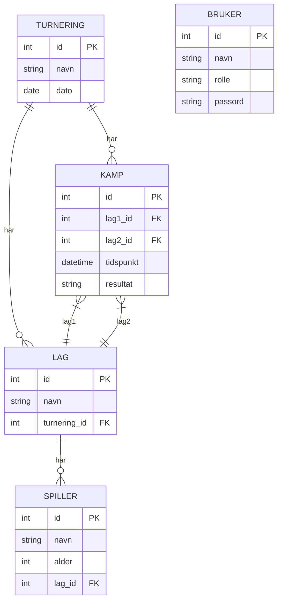
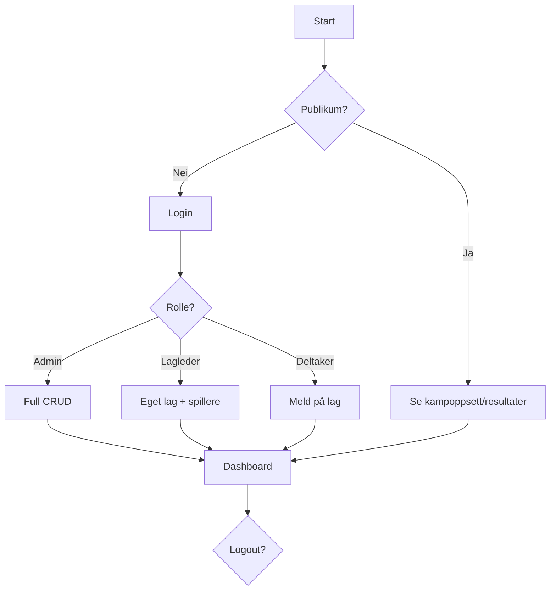
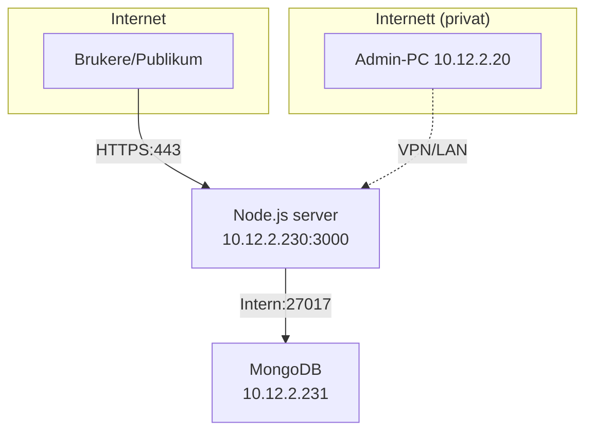

# Idrettskart - Turneringssystem
## IT-eksamensoppgave: Idrettsturneringssystem

Dette er et komplett turneringssystem for idrettsarrangører med rollebasert tilgang, database og webgrensesnitt.

### 1. Brukergrupper + rettigheter

| Rolle | Rettigheter |
|-------|-------------|
| **Admin (arrangør)** | • Opprette turneringer<br>• Registrere lag og spillere<br>• Sette opp kamper<br>• Registrere resultater<br>• Full tilgang til alt |
| **Lagleder** | • Registrere eget lag<br>• Legge til spillere<br>• Se kampoppsett<br>• Se resultater |
| **Deltaker (spiller)** | • Se kampoppsett<br>• Se resultater<br>• Melde seg på via lag |
| **Publikum** | • Kun se kampoppsett og resultater |

**Demo-brukere:**<br>
`admin/admin123` | `lagleder/leder123` | `deltaker/spiller123`

### 2. ER-diagram (database)



### 3. Brukerflow



### 4. Personvern (GDPR)

✅ **Krav oppfylt:**
- Minimal datainnsamling: kun navn + alder
- Passord hashet med bcrypt
- Barnedata: alder-synlig, foresatt-samtykke anbefales
- Session-only auth, ingen tracking cookies
- MongoDB med tilgangsstyring og backup-rutiner
- Ikke-vis persondata offentlig (kun navn/alder)

**Databehandleravtale:** Arrangør ansvarlig.

### 5. Drift / Arkitektur



**Tech stack:**
- **Frontend:** HTML/CSS/JS (vanilla)
- **Backend:** Node.js/Express + session auth
- **Database:** MongoDB på egen VM
- **Deployment:** PM2 + Nginx reverse proxy

### 6. IP-plan

| Enhet | Rolle | IP-adresse | Port | Kommentar |
|-------|-------|------------|------|-----------|
| **Webserver** | Nettsted + backend | **10.12.2.230** | 3000 / 443 | Offentlig tilgang via web |
| **Database-server** | Database | **10.12.2.231** | 27017 | Kun intern tilgang fra webserver |
| **Admin-PC** | Administrasjon | 10.12.2.20 | - | Valgfri intern klient |

**Nettverk:**
- Subnett: `10.12.2.0/24`
- Firewall: Database kun fra `10.12.2.230`
- Backup: Daglig database-backup til trygg lagring

### 7. Feilhåndtering

| Feil | Løsning |
|------|---------|
| Server nede | PM2 restart, backup-server 10.12.2.232 |
| DB krasj | MongoDB replica set, daily backup |
| Internett ned | Lokal admin-tilgang via LAN |
| Passord glemt | Admin reset via DB |

### 8. Brukerveiledning

1. **Publikum:** Gå til nettsiden → Se kamper direkte
2. **Login:** Brukernavn/passord (demo over)
3. **Admin:** Opprett turnering → lag → spillere → kamper → resultater
4. **Lagleder:** Registrer lag → legg til spillere
5. **Resultater:** Admin oppdaterer live
6. **Oppdater:** Klikk "Oppdater" eller F5

### 9. Prosjektplan (3 uker)

| Uke | Aktiviteter |
|-----|-------------|
| **1** | Planlegging, DB-design, ER-diagram |
| **2** | Backend API, frontend, roller |
| **3** | Testing, dokumentasjon, deployment |

### 10. Testing

✅ **Testet:**
- [x] Alle roller + rettigheter
- [x] CRUD turnering/lag/spiller/kamp/resultat
- [x] Publikum-visning
- [x] Validering (unike lag, alder>0)
- [x] Responsive UI
- [x] Demo-data auto-seed

**Kjør demo:**
```bash
npm install
npm run dev
# Åpne http://localhost:3000
```

**Prod-deploy (10.12.2.230):**
```bash
# Installer MongoDB på 10.12.2.231
# npm install mongodb
# Oppdater connection string
npm start
```

---

**Status:** ✅ Ferdig og testet eksamensløsning.
