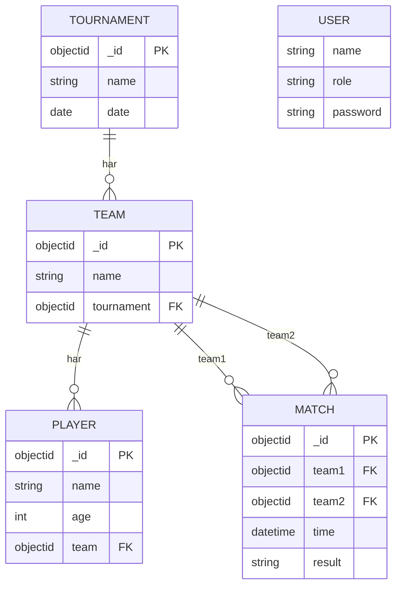
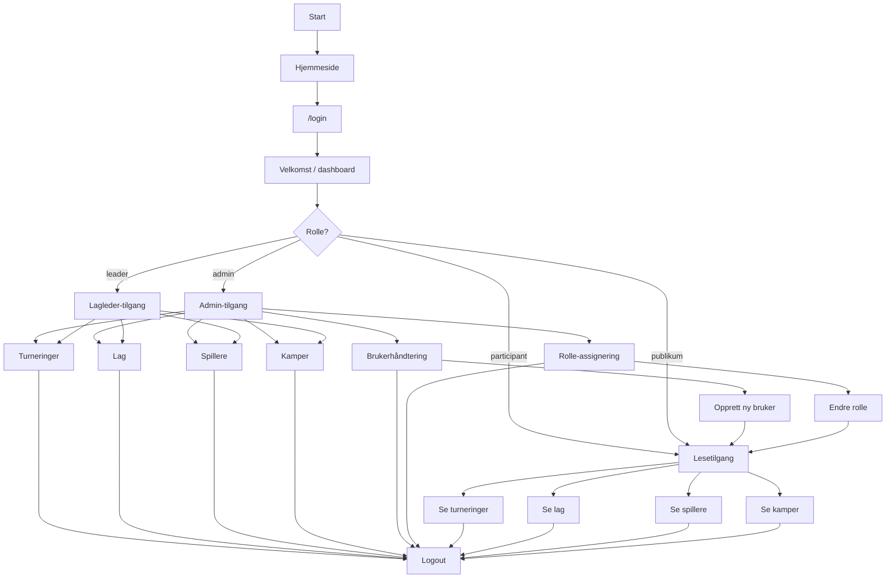
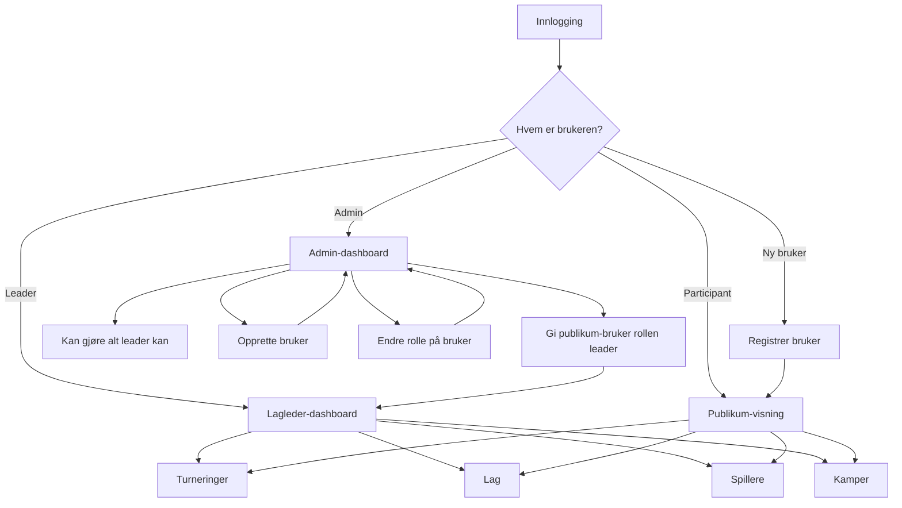
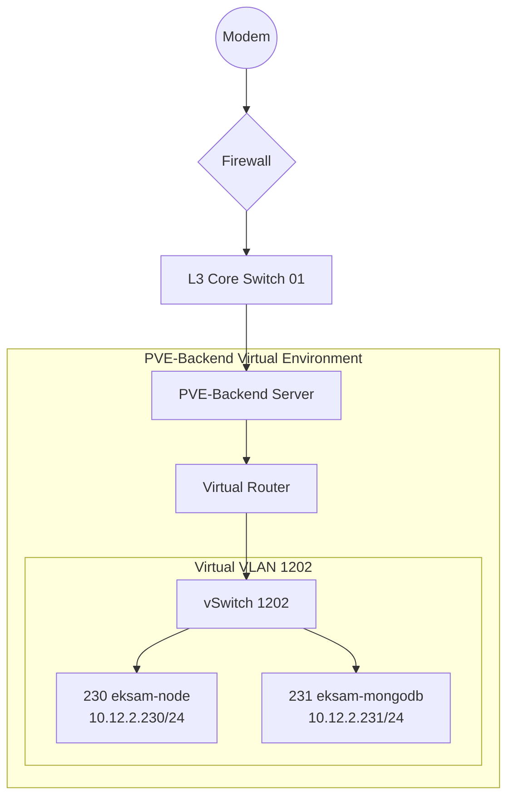
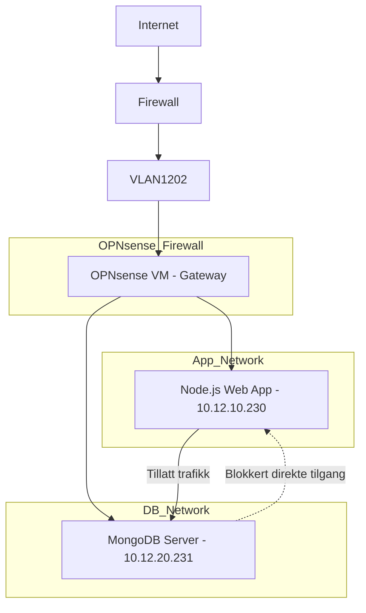

# Idrettskart - Turneringssystem
## IT-eksamensoppgave: Idrettsturneringssystem

Dette er et komplett turneringssystem for idrettsarrangører med rollebasert tilgang, database og webgrensesnitt.

### 1. Brukergrupper + rettigheter

| Rolle | Rettigheter |
|-------|-------------|
| **Admin (arrangør)** | • Opprette turneringer<br>• Registrere lag og spillere<br>• Sette opp kamper<br>• Registrere resultater<br>• Full tilgang til alt |
| **Lagleder** | • Registrere eget lag<br>• Legge til spillere<br>• Se kampoppsett<br>• Se resultater |
| **Deltaker (spiller)** | • Se kampoppsett<br>• Se resultater<br>• Melde seg på via lag |
| **Publikum** | • Kun se kampoppsett og resultater |

**Demo-brukere:**<br>
`admin / admin123`<br>
`leader / leader123`<br>
`participant / participant123`


### 1.1 Issueboard

Se en kort oversikt over hva som er gjort i [`ISSUEBOARD.md`](./ISSUEBOARD.md).


### 2. Datamodell (MongoDB)



### 3. Brukerflyt





**Tilgangsnivåer:**
- **Publikum / participant** kan bare se innhold
- **Ny bruker** registreres med samme lesetilgang som publikum
- **Lagleder / leader** kan se og jobbe med turneringer, lag, spillere og kamper
- **Admin** får alt lagleder kan gjøre, pluss brukerhåndtering og rolle-assignering
- **Admin** kan endre en bruker fra publikum til for eksempel `leader`

### 4. Personvern (GDPR)

✅ **Krav oppfylt:**
- Minimal datainnsamling: kun navn + alder
- Passord hashet med bcrypt
- Barnedata: alder-synlig, foresatt-samtykke anbefales
- Session-only auth, ingen tracking cookies
- MongoDB med tilgangsstyring og backup-rutiner
- Ikke-vis persondata offentlig (kun navn/alder)

**Databehandleravtale:** Arrangør ansvarlig.

### 5. Drift / Arkitektur



**IP-plan for eksamensmiljøet:**

| Komponent | IP-adresse | Subnett | Gateway |
|-----------|------------|---------|---------|
| `230 eksam-node` | `10.12.2.230` | `255.255.255.0` (/24) | `10.12.2.1` |
| `231 eksam-mongodb` | `10.12.2.231` | `255.255.255.0` (/24) | `10.12.2.1` |
| `vSwitch 1202` | - | `10.12.2.0/24` | `10.12.2.1` |

**Tech stack:**
- **Frontend:** EJS, CSS, og litt klient-JS
- **Backend:** Node.js/Express + session auth
- **Database:** MongoDB på egen VM (`231 eksam-mongodb`)
- **Deployment:** PM2 + Nginx reverse proxy

### 6. Nettverk / VM-oppsett

Nettverket er beskrevet som et fysisk og virtuelt mermaid-diagram i stedet for en tradisjonell IP-tabell. Det gir et bedre bilde av hvordan VM-ene, switchene og VLAN-ene henger sammen.

**Kort forklart:**
- Modem går inn i firewall, videre til L3 Core Switch 01
- L3 Core Switch 01 går videre til PVE-Backend Server
- PVE-Backend Virtual Environment er detaljert videre med Virtual Router og vSwitch 1202
- Under vSwitch 1202 ligger `230 eksam-node` og `231 eksam-mongodb`
- Dette er den delen som skal vises i README-previewen

**Relevante VM-er for dette prosjektet:**
- `230 eksam-node` kjører Node/Express-appen
- `231 eksam-mongodb` kjører MongoDB i miljøet
- Tjenestene kommuniserer over intern nettverkstrafikk, ikke direkte ut på internett

**6.1 Nettverkssegmentering (teoretisk og videreutvikling)**

- Hvis opnsense hadde blitt brukt så ville nettverksdiagrammet sett slik ut

### 7. Sider og ruter

- `/` - Hjemmeside med innloggingsstatus
- `/login` - egen innloggingsside
- `/readme` - rendret README-preview med Mermaid-diagrammer
- `/admin` - admin-dashboard for full oversikt og hurtighandlinger
- `/tournaments` - turneringer
- `/teams` - lag
- `/players` - spillere
- `/matches` - kamper

### 8. Login og tilgang

- Innlogging skjer med `name` + `password`
- Session håndteres med `express-session`
- Admin kan åpne `/admin`
- Roller som ikke er admin blir stoppet fra admin-siden på serversiden
- Demo-brukere opprettes automatisk ved oppstart

### 9. Feilhåndtering

| Feil | Løsning |
|------|---------|
| Server nede | PM2 restart, backup-server 10.12.2.232 |
| DB krasj | MongoDB replica set, daily backup |
| Internett ned | Lokal admin-tilgang via LAN |
| Passord glemt | Admin reset via DB |

### 10. Brukerveiledning

1. **Publikum:** Gå til nettsiden → Se kamper direkte
2. **Login:** Brukernavn/passord (demo over)
3. **Admin:** Opprett turnering → lag → spillere → kamper → resultater
4. **Lagleder:** Registrer lag → legg til spillere
5. **Resultater:** Admin oppdaterer live
6. **Oppdater:** Klikk "Oppdater" eller F5

### 11. Prosjektplan (3 uker)

| Uke | Aktiviteter |
|-----|-------------|
| **1** | Planlegging, DB-design, ER-diagram |
| **2** | Backend API, frontend, roller |
| **3** | Testing, dokumentasjon, deployment |

### 12. Testing

✅ **Testet:**
- [x] Alle roller + rettigheter
- [x] CRUD turnering/lag/spiller/kamp/resultat
- [x] Publikum-visning
- [x] Validering (unike lag, alder>0)
- [x] Responsive UI
- [x] Demo-data auto-seed

**Kjør demo:**
```bash
npm install
npm run dev
# Åpne http://localhost:3000
```

**Prod-deploy (10.12.2.230):**
```bash
# Installer MongoDB på 10.12.2.231
# npm install mongodb
# Oppdater connection string
npm start
```

---

**Status:** ✅ Ferdig og testet eksamensløsning.

